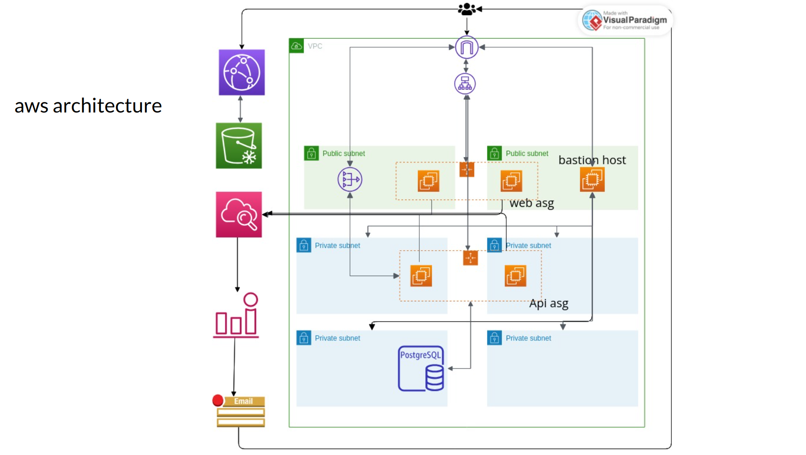

## Intro
This is not the best method to deploy a 3-tier app.
But to sake of learning I am deploying this in a traditional way without using any containers/ecs/eks/lambda

## Architecture Diagram


## Installation steps

1. Create an SSH key pair. Note: If you already have the key, ignore this step.

    ```bash
    ssh-keygen -t rsa -b 2048 -f ~/.ssh/id-rsa
    ```

2. Deploy the backend Terraform.

    ```bash
    cd terraform-backend
    terraform init
    terraform apply
    ```

3. Deploy the Terraform folder.

    ```bash
    export stage='<stage>' # only staging/production supported
    cd Sandip-kumar/terraform
    terraform init
    terraform workspace select $stage || terraform workspace new $stage
    terraform plan -no-color --var-file=$stage.tfvars
    terraform apply --var-file=$stage.tfvars
    ```


Note:

`More Information, Refer to the Presentation (PPT) and Respective Folder README`
